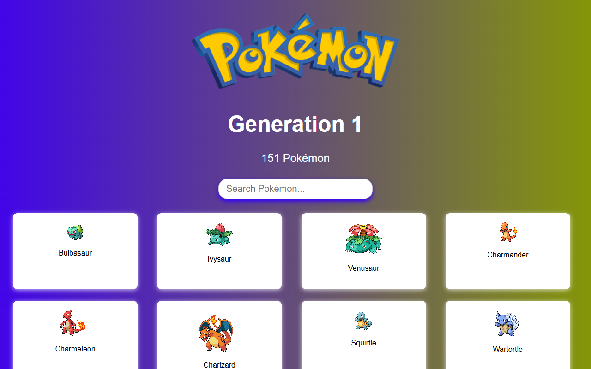
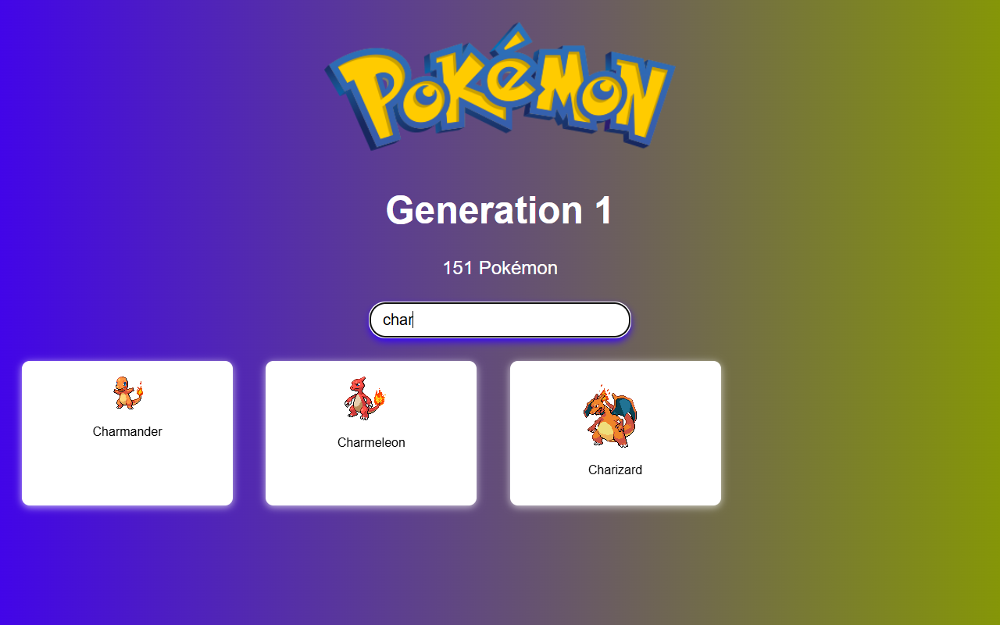
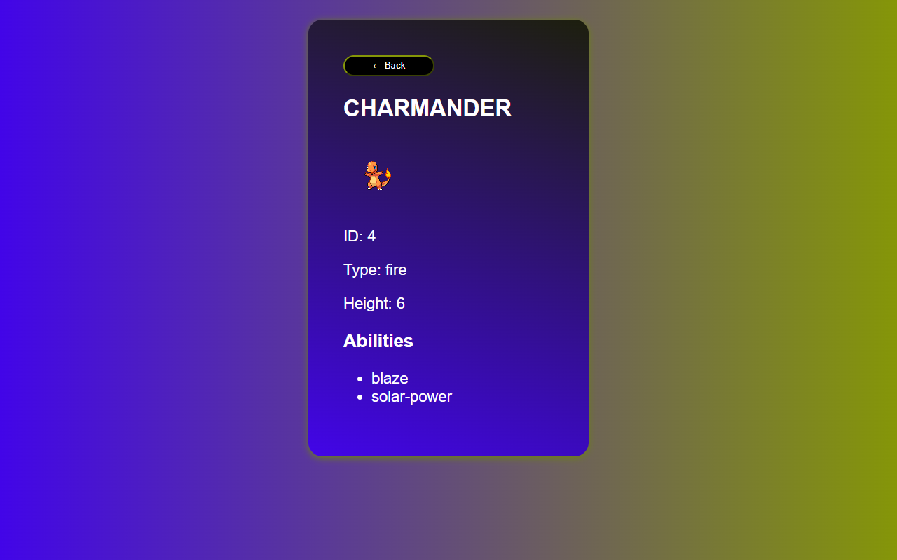

# Pokemon Pokedex - Generation 1

<div align="center">


</div>

---

## Ekran Goruntuleri

### Ana Sayfa
Tum 151 Pokemon animasyonlu GIF sprite'lariyla birlikte kart gorunumunde listelenir. Ust kisimda Pokemon logosu, nesil bilgisi ve arama cubugu yer alir.

<div align="center">

</div>

### Arama
Arama cubuguna yazi yazildiginda liste anlik olarak filtrelenir. Ornegin "char" yazildiginda sadece Charmander, Charmeleon ve Charizard gosterilir.

<div align="center">

</div>

### Detay Sayfasi
Herhangi bir karta tiklandiginda o Pokemon'un ID, tip, boy ve yetenek bilgilerini iceren detay sayfasi acilir.

<div align="center">

</div>

---

## Hakkinda

PokéAPI uzerinden Kanto bolgesindeki 151 Pokemon'u ceken, listeleyen ve detaylarini gosteren bir React uygulamasi. Kullanicilar isme gore arama yapabilir, kartlara tiklayarak her Pokemon'un tipini, boyunu ve yeteneklerini gorebilir.

---

## Ozellikler

- 151 Pokemon'un animasyonlu GIF sprite'lariyla grid duzende listelenmesi
- Isme gore anlik filtreleme yapan arama cubugu
- Her Pokemon icin ID, tip, boy ve yetenek bilgisi gosteren detay sayfasi
- Detay sayfasindan tek tikla geri donus
- Vite HMR ile hizli gelistirme dongusu
- Mor-yesil gradient tema

---

## Teknolojiler

### Ana Bagimliliklar

| Paket | Versiyon | Kullanim |
|---|---|---|
| React | 19.1.0 | UI bilesenleri |
| Vite | 7.0.0 | Build araci ve dev server |
| React Router DOM | 7.6.3 | Sayfa yonlendirme |
| Redux Toolkit | 2.8.2 | State yonetimi |
| React Redux | 9.2.0 | Redux-React baglantisi |
| Axios | 1.10.0 | HTTP istekleri |

### Gelistirme Araclari

| Paket | Kullanim |
|---|---|
| ESLint | Kod kalite kontrolu |
| eslint-plugin-react-hooks | React Hooks kurallari |
| eslint-plugin-react-refresh | Fast Refresh uyumlulugu |
| @vitejs/plugin-react | Vite icin Babel tabanli React destegi |

---

## Proje Yapisi

```
pokemon/
├── public/
│   └── vite.svg
├── src/
│   ├── assets/
│   │   └── pokemonlogo.png
│   ├── components/
│   │   ├── PokemonCard.jsx        # Tek bir Pokemon karti
│   │   ├── PokemonHeader.jsx      # Logo ve baslik
│   │   └── SearchBar.jsx          # Arama cubugu
│   ├── redux/
│   │   ├── pokemonSlice.js        # Async thunk ve reducer
│   │   └── store.js               # Redux store
│   ├── routes/
│   │   ├── PokemonList.jsx        # Ana sayfa
│   │   └── PokemonDetail.jsx      # Detay sayfasi
│   ├── styles/
│   │   └── App.css                # Tum stiller
│   ├── utils/
│   │   └── api.js                 # API istekleri
│   ├── App.jsx                    # Route tanimlari
│   └── main.jsx                   # Giris noktasi
├── screenshots/
│   ├── homepage.png
│   ├── search.png
│   └── detail.png
├── index.html
├── package.json
├── vite.config.js
└── eslint.config.js
```

---

## Bilesen Yapisi

```
main.jsx
 └── Provider (Redux Store)
      └── BrowserRouter
           └── App
                ├── "/" → PokemonList
                │        ├── PokemonHeader
                │        ├── SearchBar
                │        └── PokemonCard (x151)
                └── "/pokemon/:name" → PokemonDetail
```

### PokemonList
Ana sayfa. Mount oldugunda `fetchAllPokemon()` ile 151 Pokemon'u ceker. Arama cubugundaki degere gore listeyi filtreler. Yukleme surerken "Loading..." gosterir.

### PokemonDetail
URL'deki `name` parametresini alir, Redux thunk'i uzerinden API'ye istek atar. Gelen veriyle sprite, ID, tip, boy ve yetenekleri gosterir. Geri butonu bir onceki sayfaya doner.

### PokemonCard
Animasyonlu GIF sprite ve capitalize edilmis ismi gosterir. Tiklayinca `/pokemon/{name}` rotasina yonlendirir.

### PokemonHeader
Pokemon logosunu, "Generation 1" basligini ve "151 Pokemon" alt yazisini icerir.

### SearchBar
Kontrollu input bileseni. Ust bilesenden `value` ve `onChange` props alir.

---

## State Yonetimi

Pokemon detay verisi Redux Toolkit ile yonetilir. Liste verisi ise PokemonList bileseninin lokal state'inde tutulur.

### Store Yapisi

```
store
 └── pokemon
      ├── detail: Object | null   → Secili Pokemon verisi
      └── loading: boolean        → Yukleme durumu
```

### fetchPokemonDetail Thunk

| Durum | loading | detail |
|---|---|---|
| pending | true | degismez |
| fulfilled | false | API yanitini alir |
| rejected | false | degismez |

---

## API

Veri kaynagi olarak [PokeAPI v2](https://pokeapi.co/) kullanilir.

| Endpoint | Dosya | Aciklama |
|---|---|---|
| `GET /api/v2/pokemon?limit=151` | `utils/api.js` | Tum 1. nesil Pokemon listesi |
| `GET /api/v2/pokemon/{name}` | `redux/pokemonSlice.js` | Tek bir Pokemon'un detayi |

Kartlardaki animasyonlu GIF'ler PokemonDB uzerinden yuklenir:
```
https://img.pokemondb.net/sprites/black-white/anim/normal/{name}.gif
```

---

## Kurulum

**Gereksinimler:** Node.js v18+, npm v9+

```bash
# Repoyu klonla
git clone https://github.com/Tuna-hero/pokemon.git
cd pokemon

# Bagimliliklari yukle
npm install

# Gelistirme sunucusunu baslat
npm run dev
```

Uygulama `http://localhost:5173` adresinde acilir.

### Diger Komutlar

| Komut | Aciklama |
|---|---|
| `npm run build` | Uretim build'i olusturur |
| `npm run preview` | Build edilmis halini onizler |
| `npm run lint` | ESLint ile kod kontrolu yapar |

---

## Lisans

Bu proje egitim amaciyla gelistirilmistir. Pokemon ve ilgili icerikler Nintendo, Creatures Inc. ve GAME FREAK inc. sirketlerine aittir.
